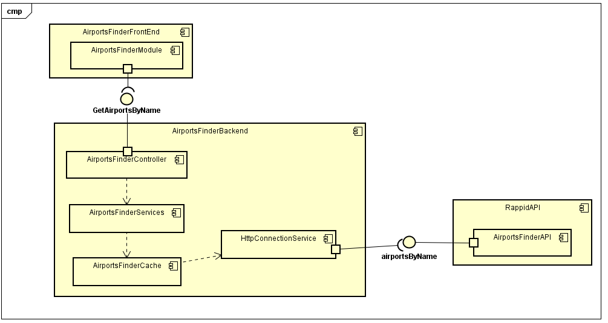

# Parcial Segundo tercio - ARWS - Juan Pablo Ospina 

## El diseño de arquitectura. 
# Diagrama de despliegue

# Diagrama de componentes

se modifico para que desde el cache se consulte el otro appi ya que este es el que determina cuando se deben realizar las peticiones

## La forma de ejecutar el programa localmente. 
Se debe tener instalado maven 

* Para correr las pruebas :
mvn package

* Para corer localmente la aplicacion:

mvn sprin-boot:run

## Explicar cómo se puede extender y cómo podría, por ejemplo, hacer que una función específica la implementara un proveedor de servicios diferente.

Si se requieren mas servicios desde el api que se esta consultado se podra tener diferentes servicos siempre y cuando se replique el modo de realizar peticiones, pero si se necesita cmabiar de peticion a la appi solo es cambiar la url en la carpeta connection la cual nos permite realizar las diferentes petciones a la api externa.

Ademas cabe reslatar que al pasar todo a objeto los elementos se pueden manipular mucho mas facil, dejando asi mas oportunidades de mejora al momento de realizar nuevos servicios.

## Indique la urls de Heroku

link de heroku [link.](https://juan-ospina-arsw-t2.herokuapp.com/)
